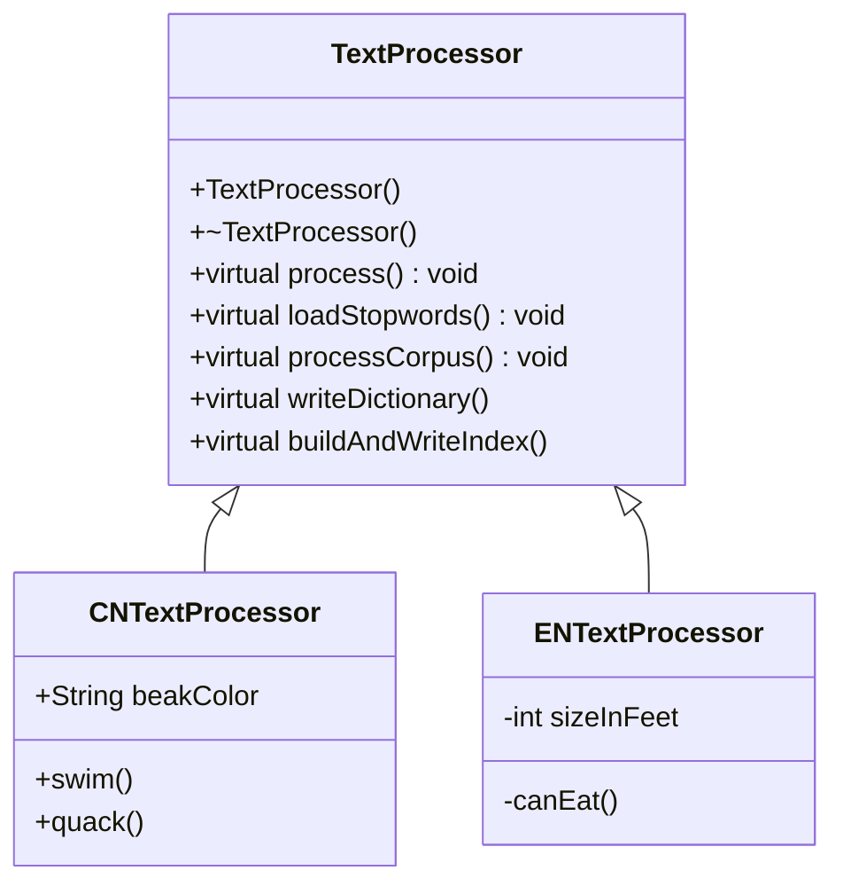

```mermaid
classDiagram
    TextProcessor <|-- CNTextProcessor
    TextProcessor <|-- ENTextProcessor
    TextProcessor: +TextProcessor()
    TextProcessor: +~TextProcessor()
    TextProcessor: +virtual process() void
    TextProcessor: +virtual loadStopwords() void 
    TextProcessor: +virtual processCorpus() void
    TextProcessor: +virtual writeDictionary()
    TextProcessor: +virtual buildAndWriteIndex()
    class CNTextProcessor{
      +String beakColor
      +swim()
      +quack()
    }
    class ENTextProcessor{
      -int sizeInFeet
      -canEat()
    }
            
```