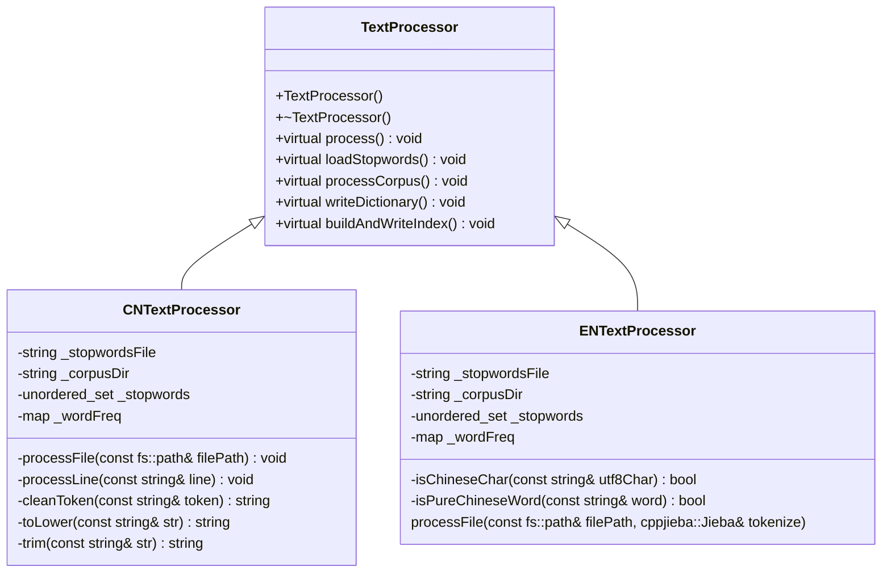

```mermaid
classDiagram
    TextProcessor <|-- CNTextProcessor
    TextProcessor <|-- ENTextProcessor
    TextProcessor: +TextProcessor()
    TextProcessor: +~TextProcessor()
    TextProcessor: +virtual process() void
    TextProcessor: +virtual loadStopwords() void 
    TextProcessor: +virtual processCorpus() void
    TextProcessor: +virtual writeDictionary() void
    TextProcessor: +virtual buildAndWriteIndex() void
    class CNTextProcessor{
      -string _stopwordsFile
      -string _corpusDir
      -unordered_set<string> _stopwords
      -map<string, int> _wordFreq
      -processFile(const fs::path& filePath) void
      -processLine(const string& line) void 
      -cleanToken(const string& token) string
      -toLower(const string& str) string
      -trim(const string& str) string
    }
    class ENTextProcessor{
      -string _stopwordsFile
      -string _corpusDir
      -unordered_set<string> _stopwords
      -map<string, int> _wordFreq
      -isChineseChar(const string& utf8Char) bool
      -isPureChineseWord(const string& word) bool
      processFile(const fs::path& filePath, cppjieba::Jieba& tokenize)
    }
    %%  string _stopwordsFile; // 存放停用词文件名
    %%  string _corpusDir; // 存放语料库目录
    %%  unordered_set<string> _stopwords; // 用来存放停用词
    %%  map<string, int> _wordFreq;
```