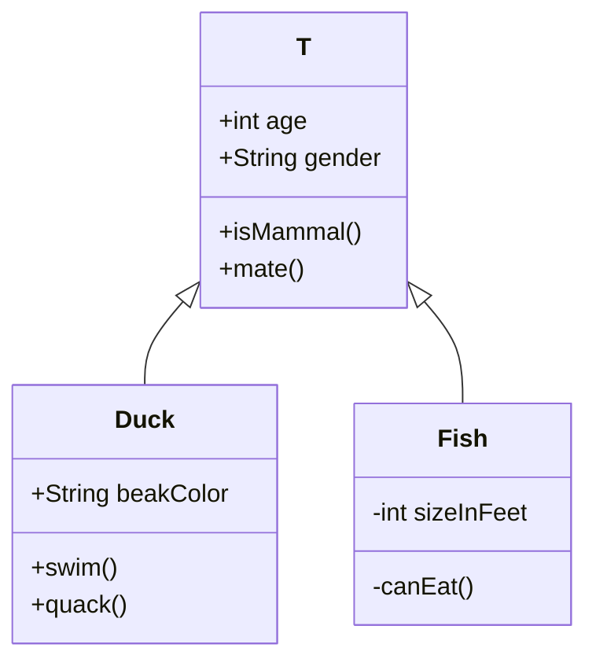

```mermaid
classDiagram
    T <|-- Duck
    T <|-- Fish
    T : +int age
    T : +String gender
    T: +isMammal()
    T: +mate()
    class Duck{
      +String beakColor
      +swim()
      +quack()
    }
    class Fish{
      -int sizeInFeet
      -canEat()
    }
            
```