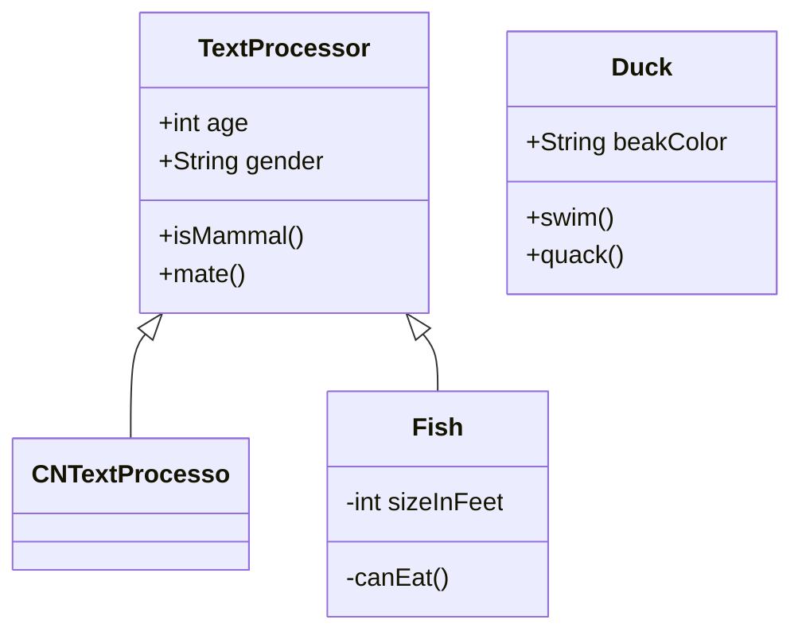

```mermaid
classDiagram
    TextProcessor <|-- CNTextProcesso
    TextProcessor <|-- Fish
    TextProcessor : +int age
    TextProcessor : +String gender
    TextProcessor: +isMammal()
    TextProcessor: +mate()
    class Duck{
      +String beakColor
      +swim()
      +quack()
    }
    class Fish{
      -int sizeInFeet
      -canEat()
    }
            
```